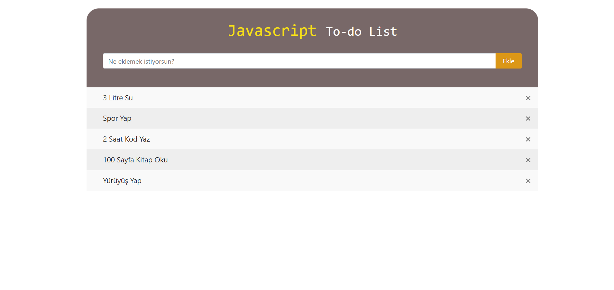
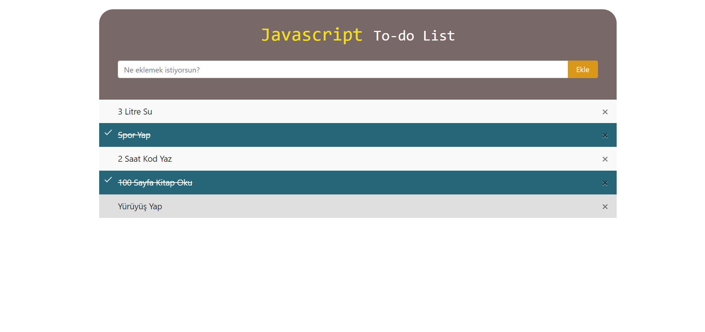

# js-to-do-list

## JS kullanarak yapmış olduğum to-do list projesi.

*Boş bir input girdiğimizde hata alıyoruz.*

*Listeye bir görev eklediğimizde bir bilgilendirme mesajı alıyoruz.*

**Not: İlerliyen zamanlarda bir depolama öğrendiğimde proejeyi güncellemeyi düşünüyorum. Local Storage boyut ve kullanışlılık açısından pek iyi olmadığından eklemedim.**
